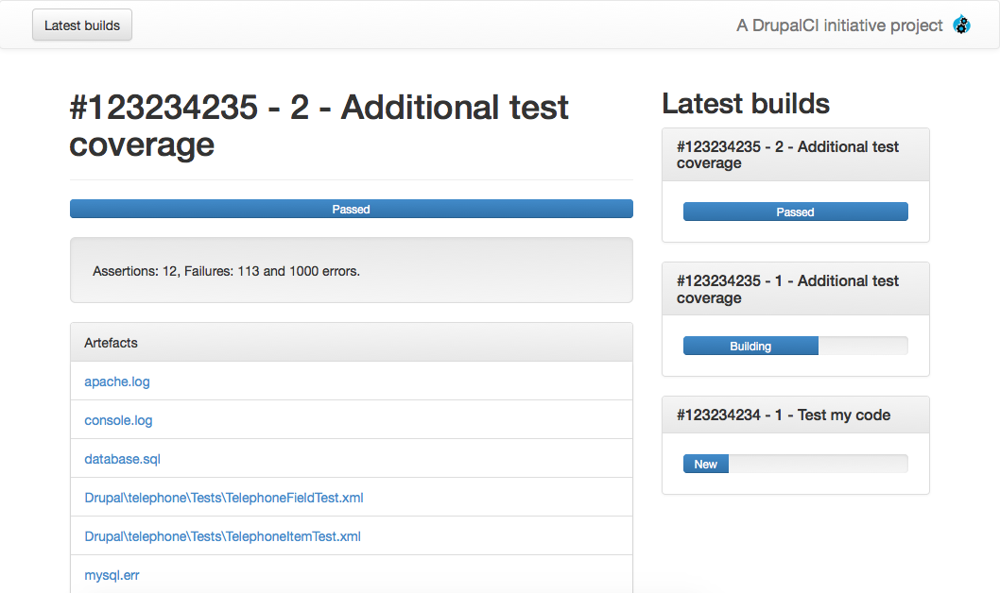

# The DrupalCI initiative

---

# The future of Drupal.org CI

---

## Overview

* What is CI?
* The origin story of Drupal and CI
* The state of Drupal and CI
* DrupalCI
* Components
* Questions and DEMANDS!!!!

---

## Me

* Nick Schuch (nick_schuch)
* PreviousNext
* Dev / Sys
* PHP, Puppet, Docker, Golang (All the techs!)

---

## Continuous integration

Continuous Integration (CI) is a development practice that requires developers to integrate code into a shared repository several times a day. Each check-in is then verified by an automated build, allowing teams to detect problems early.

---

## The origin story

http://privatepaste.com/ea66340d21

---

## Current

* Patch workflow
* Drupal site to manage builds (https://qa.drupal.org/pifr/status)
* Puppet manifest for "nodes" built by people
* Only test one version
* No tests for the infrastructure

---

## Goals

* Leverage industry standards
* Less custom code
* More versions
* Provide tools for better testing
* Automate everything
* Test our own code
* Ship as images for Vagrant / AWS / Docker

---

## The main goal

* Build for the community

---

## Components

---

## Diagram

---

## API

* Silex (Symfony micro framework)
* Abstraction layer
* Drupal.org / CLI integration point

---

## Dispatcher

* Jenkins
* Queues builds
* Starts compute if required
* Starts the "Job runner" component
* Packaging status
 * Vagrant - Yes
 * AWS AMI - Yes
 * Docker - No

---

## Job Runner

* The DrupalCI workflow
* Symfony console
* Spins up containers (Docker)
* Runs the test script
* Packaged as a PHAR

---

## Demo

---

## PrivateTravis

* Compatibilty layer
* Symfony console
* Brings back projects running on Github
* Enables existing projects to have all the benefits of Travis

---

## Results

* Extremely important
* Built on Drupal 8
* CLI built on Symfony console
* All records / artefacts driven by CLI
* CLI generates the famous *1 Passed, 1000000 failed* message

---

## Screenshot - Latest

---

## Screenshot - Build

---

## Demo

---

## Project ideas

* A gist.github.com like service
* Drush command

---

## Call to arms

---

## Contact

* **Weekly Hangout**: 
 * Google hangout - http://bit.ly/1sBysAN
 * Timezone - https://bitly.com/shorten/

* **IRC**: #drupal-testing.
 * Jeremy Thorson - jthorson
 * Nick Schuch - nick_schuch
 * Ricardo Amaro - ricardoamaro

---

## Questions and DEMANDS!!!

